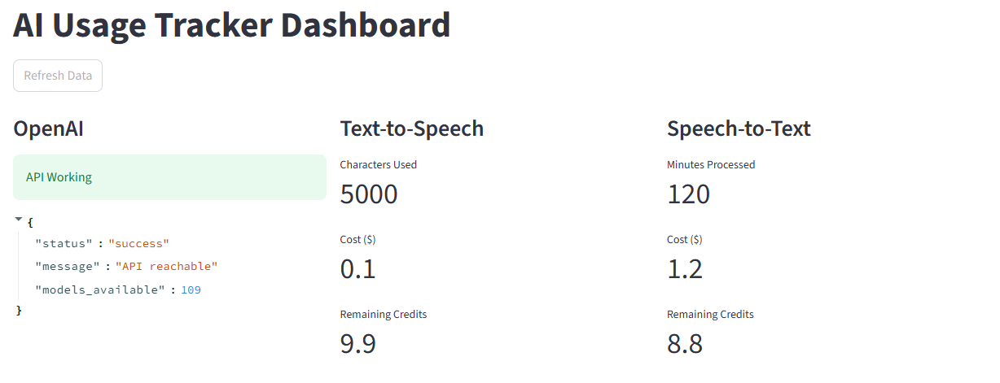
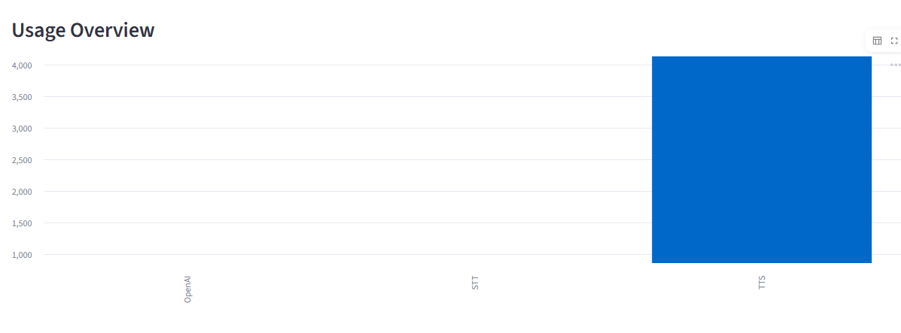

# AI Usage Tracker Dashboard

## Overview
This project is a simple AI usage tracking platform that integrates multiple AI service providers and displays their usage and billing information through a dashboard.

---

## Features
- Integration with LLM provider (OpenAI)
- Mocked integration for:
  - Text-to-Speech (ElevenLabs)
  - Speech-to-Text (Deepgram)
- FastAPI backend for API handling
- Streamlit dashboard for visualization
- Real-time API-based data fetching
- Error handling for API failures

---

## Architecture
Frontend (Streamlit) → Backend (FastAPI) → Service Layer → External APIs

---

## Tech Stack
- Python
- FastAPI
- Streamlit
- Requests
- OpenAI API

---

## Dashboard Features
- API usage per provider
- Cost tracking
- Remaining credits
- Error handling display
- Usage visualization (charts)

---

## Setup Instructions

### Step 1: Clone the repository
```bash
git clone <your_repo_link>
cd AI_USAGE_TRACKER
```

### Step 2: Create virtual environment
```bash
python -m venv venv
venv\Scripts\activate
```

### Step 3: Install dependencies
```bash
pip install -r requirements.txt
```

### Step 4: Add environment variables
Create a `.env` file in the root directory:

```env
OPENAI_API_KEY=your_api_key_here
```

### Step 5: Run backend server
```bash
uvicorn app.main:app --reload
```

### Step 6: Run Streamlit dashboard
```bash
streamlit run dashboard.py
```

---

## Notes
- OpenAI API may show quota errors if limits are exceeded.
- TTS and STT data are mocked for demonstration purposes.
- Architecture supports easy integration of real APIs.

---

## Future Improvements
- Real billing API integration
- Database for usage tracking
- Authentication system
- Live updates using WebSockets

---


## 📸 Dashboard Screenshots

### View 1


### View 2


---

## Demo Video
(Add your demo video link here)

---

## Author
Divya Malviya